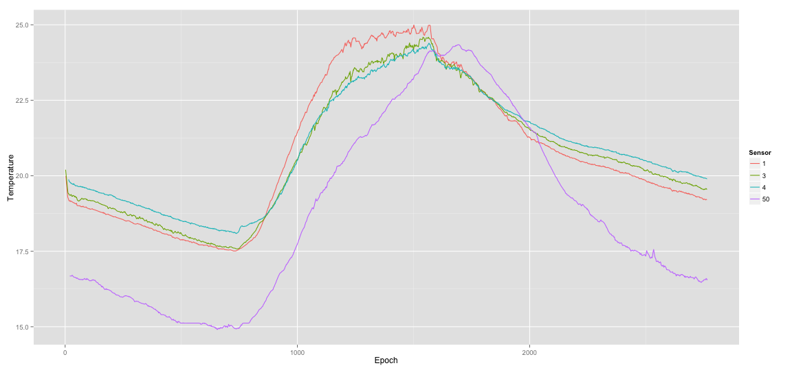

Planning Sensors' Energy Savings
========================================================
author: Gabriel Martins Dias
date: 22/03/2015
transition:rotate

<small>
PhD student  
Department of Information and Communication Technologies  
Pompeu Fabra University
</small>


Introduction
========================================================

54 sensors were positioned inside a room to monitor 
general information about the environment:

- Temperature
- Relative Humidity
- Light
- Voltage (in the sensors)

***


Data
========================================================

Part of the data, which contains several types of measurements from different sensors:


```r
print(xtable(wsn.data[idx, ]), type="html")
```

<!-- html table generated in R 3.1.2 by xtable 1.7-4 package -->
<!-- Sun Mar 22 22:33:40 2015 -->
<table border=1>
<tr> <th>  </th> <th> Date </th> <th> Epoch </th> <th> Sensor </th> <th> Temp. </th> <th> Humidity </th> <th> Light </th> <th> Volt. </th>  </tr>
  <tr> <td align="right"> 137887 </td> <td> 28/Feb </td> <td align="right"> 1863 </td> <td align="right">   4 </td> <td align="right"> 22.41 </td> <td align="right"> 35.47 </td> <td align="right"> 195.04 </td> <td align="right"> 2.70 </td> </tr>
  <tr> <td align="right"> 386640 </td> <td> 28/Feb </td> <td align="right"> 2078 </td> <td align="right">  11 </td> <td align="right"> 19.98 </td> <td align="right"> 40.70 </td> <td align="right"> 4.60 </td> <td align="right"> 2.68 </td> </tr>
  <tr> <td align="right"> 694275 </td> <td> 01/Mar </td> <td align="right"> 7435 </td> <td align="right">  21 </td> <td align="right"> 32.44 </td> <td align="right"> 24.51 </td> <td align="right"> 172.96 </td> <td align="right"> 2.79 </td> </tr>
  <tr> <td align="right"> 980546 </td> <td> 28/Feb </td> <td align="right"> 1742 </td> <td align="right">  26 </td> <td align="right"> 24.24 </td> <td align="right"> 32.26 </td> <td align="right"> 713.92 </td> <td align="right"> 2.75 </td> </tr>
  <tr> <td align="right"> 1841932 </td> <td> 01/Mar </td> <td align="right"> 8203 </td> <td align="right">  44 </td> <td align="right"> 19.18 </td> <td align="right"> 44.42 </td> <td align="right"> 32.20 </td> <td align="right"> 2.65 </td> </tr>
  <tr> <td align="right"> 1891245 </td> <td> 01/Mar </td> <td align="right"> 7233 </td> <td align="right">  45 </td> <td align="right"> 28.85 </td> <td align="right"> 29.33 </td> <td align="right"> 713.92 </td> <td align="right"> 2.76 </td> </tr>
   </table>

Source: http://db.lcs.mit.edu/labdata/labdata.html

Similarity of the measurements
========================================================


Sensors positioned close to each other (1,3,4) make similar measurements. 
However, sensors placed far from each other (1,50) measure completely different values:



Problem Statement
========================================================

## Can we predict the measurements of a sensor using measurements from the others?
 
- If yes, it will be possible to turn off some sensors for a while and save their battery for the future.

## Methodology

- Observing the data from one day, we build a prediction model using Random Forest. 
Then, we observe if the model is able to predict the temperature measurements of another day.
Each predicted measurement cannot differ by more than a certain value, which is defined by the user.
